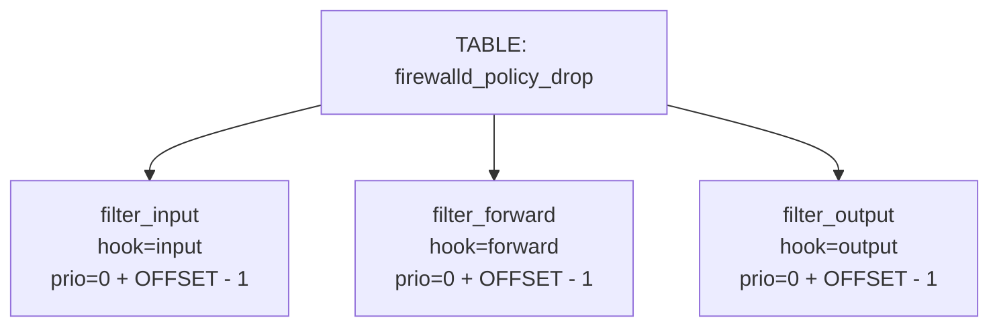

If you ask the average practitioner where the Linux firewall lives, they’ll probably say “the kernel” or “ring 0.” That’s a reasonable answer. In day-to-day operations, you don’t need to think much beyond that — you configure `nft`, maybe `ufw`, maybe `iptables`, and packets get filtered.

Like most important systems, that answer is true — and incomplete.

The packet filter executes in the kernel. But a surprising amount of structural work happens in user space before the kernel ever sees a rule.

That userland code is what allows you to write something like:

```nft
table inet filter {
  chain input {
    type filter hook input priority 0;
    policy drop;

    ct state established,related accept
    iif lo accept
    tcp dport 22 accept
  }
}

```

which then gets transformed into representations we send to the kernel like this:

```json
{
  "nftables": [
    {
      "table": {
        "family": "inet",
        "name": "filter"
      }
    },
    {
      "chain": {
        "family": "inet",
        "table": "filter",
        "name": "input",
        "type": "filter",
        "hook": "input",
        "prio": 0,
        "policy": "drop"
      }
    },
    {
      "rule": {
        "family": "inet",
        "table": "filter",
        "chain": "input",
        "expr": [
          {
            "match": {
              "left": { "ct": { "key": "state" } },
              "op": "in",
              "right": {
                "set": ["established", "related"]
              }
            }
          },
          { "accept": null }
        ]
      }
    },
    {
      "rule": {
        "family": "inet",
        "table": "filter",
        "chain": "input",
        "expr": [
          {
            "match": {
              "left": { "meta": { "key": "iifname" } },
              "op": "==",
              "right": "lo"
            }
          },
          { "accept": null }
        ]
      }
    },
    {
      "rule": {
        "family": "inet",
        "table": "filter",
        "chain": "input",
        "expr": [
          {
            "match": {
              "left": { "payload": { "protocol": "tcp", "field": "dport" } },
              "op": "==",
              "right": 22
            }
          },
          { "accept": null }
        ]
      }
    }
  ]
}
```

By the time this representation is sent to the kernel, questions of _why_ a rule exists or _what policy it expressed_ are no longer available, only _what objects to install_.

Between these representations, a privileged userland stack parses, normalizes, and lowers firewall rules. Userland isn’t just configuring the firewall — it’s compiling it.

## The netfilter pipeline 

Ok but what does that actually mean?

To understand why this matters, it helps to look at the full path a firewall rule takes from human intent to kernel enforcement.

At a high level, the netfilter pipeline looks like this:

1. **Human intent**
    
2. **User-facing configuration**
    
3. **Userland compilation**
    
4. **Netlink serialization**
    
5. **Kernel validation and installation**
    
6. **Packet-time execution**
    

Each stage narrows what the system can _represent_, and each boundary shifts responsibility.

### 1. Human intent

This is the part everyone understands intuitively.

You want to:

- allow SSH,
    
- drop unsolicited traffic,
    
- permit established connections,
    
- maybe block a dynamic set of addresses.
    

Intent lives here. It’s contextual, policy-driven, and full of assumptions:

- _Why_ a rule exists
    
- _What_ it’s protecting
    
- _What_ tradeoffs are acceptable
    

None of this is machine-checkable. It only exists in the operator’s head or in documentation.

### 2. User-facing configuration

Intent gets expressed through interfaces like:

- nft syntax
    
- JSON APIs
    
- higher-level tools like `ufw` or `firewalld`
    

This layer still speaks in **policy language**:

- chains have names that mean something to humans
    
- rules are ordered in ways that imply priority
    
- constructs like `ct state established,related` encode domain knowledge
    

Crucially, this layer is _lossy but still legible_. You can usually read a ruleset and understand what the author was trying to do.

### 3. Userland compilation

This is the step most people mentally collapse into “the kernel,” but it happens **before** the kernel sees anything.

Here, userland libraries:

- parse configuration
    
- resolve defaults
    
- normalize rule ordering
    
- expand shorthand
    
- construct explicit tables, chains, rules, expressions, and sets
    
- establish references between objects
    
- batch operations into atomic transactions

The output is no longer “allow SSH” — it’s:

- a rule object
    
- containing a sequence of expressions
    
- with registers, offsets, flags, and handles
    
- referencing other objects by name or ID
    

From this point on, the system no longer knows _why_ a rule exists — only _how_ to install it.

### 4. Netlink serialization

Once the in-memory object graph is complete, it is serialized into Netlink messages.

This step is mechanical but irreversible:

- structured objects become byte streams
    
- relationships become numeric references
    
- optional semantics become flags and attributes
    

Netlink does not carry intent.  
It carries instructions.

At this boundary, only structure remains.

### 5. Kernel validation and installation

The kernel receives the Netlink batch and performs validation:

- are required attributes present?
    
- are types correct?
    
- are references resolvable?
    
- are constraints satisfied?
    

Importantly, the kernel is **not re-deriving policy**.  
It assumes the userland knew what it was doing.

If validation passes, the objects are installed atomically.  
If it fails, the whole batch is rejected.

This is enforcement, not interpretation.

### 6. Packet-time execution

Finally, at runtime:

- packets traverse hooks
    
- chains are evaluated
    
- expressions execute in order
    
- state is consulted and mutated
    

This is the part most people mean when they say “the firewall lives in the kernel.”

And they’re right — **execution** does.

But by the time a packet hits this stage, every meaningful decision about structure, relationships, and semantics has already been fixed elsewhere.
 
## Why should I care?

Because **semantic authority** is a security boundary.

By _semantic authority_, I mean the power to decide **what a configuration means** — not just whether it is syntactically valid, but how intent is interpreted, normalized, coerced, and ultimately made real.

In the nftables stack, much of that authority sits in userland.  
Policy is parsed, defaults are chosen, shorthand is expanded, and rules are normalized before the kernel ever sees them. The kernel enforces what it receives; it does not reinterpret it.

That’s why disagreements between policy compilers matter.

If `firewalld`, `libnftables`, `libnftnl`, and the kernel disagree about what a rule _means_, you don’t need memory corruption for the result to be security-relevant. You get policy confusion. Silent widening. Constraints erased. Defaults reintroduced. Classic confused-deputy failure modes — just expressed through configuration semantics instead of syscalls.

That observation makes the stack worth exploring.

In the process, I built a tool: a structured fuzzer designed specifically to explore what I’ve been calling userland compilation — the point where policy is lowered into concrete objects. This part of the stack is both highly privileged and surprisingly under-analyzed.

My security instincts tend to focus on seams — the spaces in between. The boring parts. In complex systems, those layers are often load-bearing even when they don’t look like it. Over the course of my work, that pattern has shown up again and again, and I think it applies here too.

What follows isn’t a polished exploit write-up. I’m going to show you some code, some structures, and the mental model I built by running this stack adversarially. The fuzzer was deliberately designed to be legible and transferable — opinionated enough that the Nim is pleasant to read, but not so clever that you need to be a C or kernel expert to follow along.

I’m not a specialist bug hunter, and this wasn’t an attempt to become one overnight. Even though I ran the fuzzer for dozens of hours with instrumentation, metrics, and monitoring in place, the goal wasn’t primarily to find a crash.

I don’t have pretty graphs or a polished corpus.

What I _do_ have is a map of where semantic authority lives in this stack — and a research direction I think is worth handing to people who operate here full-time.

So let’s look at some code.

## Nftnl

The specific library I targeted was **libnftnl**, which sits squarely in stage **(3) Userland compilation**.

To make that concrete, here’s a minimal but complete example of what libnftnl actually does. This test constructs a table, a base chain, a rule, attaches an expression, and serializes the result into a Netlink message.

```nim
test "build table+base chain+rule+expr into nlmsg and pretty-print":
  # Step 1: construct a table
  var t = Table.create()
  t.family = AF_INET
  t.name = "filter"

  # Step 2: construct a base chain
  var c = Chain.create()
  c.family = AF_INET
  c.table = "filter"
  c.name = "input"
  c.typeName = "filter"
  c.hooknum = NF_INET_LOCAL_IN.uint32
  c.prio = 0'u32
  c.policy = NF_ACCEPT

  # Step 3: construct a rule
  var r = Rule.create()
  r.family = AF_INET
  r.table = "filter"
  r.chain = "input"

  # Step 4: add a comparison expression
  var e = CmpExpr.create()
  e.sreg = 1'u32
  e.op = NFT_CMP_EQ
  e.data = @[0x12'u8, 0x34'u8]
  addExpr(r, move e)

  # Step 5: prepare Netlink message
  let nlh =
    newNlMsg(NFT_MSG_NEWRULE.cint, AF_INET.cint, NLM_F_CREATE or NLM_F_ACK, 1'u32)

  # Step 6: serialize rule into Netlink payload
  buildRuleMsg(nlh, r)

  # Step 7: pretty-print the constructed rule
  var buf = newString(4096)
  let written = nftnl_rule_snprintf(
    cast[ptr uint8](buf.cstring),
    buf.len.csize_t,
    r.raw,
    NFTNL_OUTPUT_DEFAULT.uint32,
    0'u32,
  )
  check written > 0
```

There are a few important things to notice here.

First: **nothing here is “policy.”**  
There is no notion of “allow SSH,” no default chains, no implicit behavior. We are manually constructing objects and wiring them together.

Second: **libnftnl owns structure, not meaning.**  
Tables, chains, rules, and expressions are heap-allocated objects. Attributes are set explicitly. Expressions are appended in order. Once attached, ownership transfers — note the `move e` when adding the expression to the rule.

Third: **serialization is the end of the line.**  
By the time `buildRuleMsg()` runs, every meaningful decision has already been made. The Netlink payload that falls out of this process contains instructions — not intent.

This is libnftnl’s role in the stack.

It does not decide _whether_ a rule makes sense.  
It decides _how_ a rule is represented.

It does not decide policy. It decides representation.

### What This Test Is Really Showing

There’s an important detail hiding in that integration test, and it’s easy to miss.

If you look closely, **none of these objects actually reference each other in memory**.

Take the table again:

```nim
var t = Table.create()
t.family = AF_INET
t.name = "filter"
```

The table is named `"filter"`. That’s it. There is no pointer to a chain list. No back-reference. No ownership relationship.

Now look at the chain:

```nim
var c = Chain.create()
c.family = AF_INET
c.table = "filter"
```

The chain doesn’t _point_ to the table. It doesn’t hold a reference. It just stores the string `"filter"`.

Same story for rules:

```nim
var r = Rule.create()
r.family = AF_INET
r.table = "filter"
r.chain = "input"
```

Again: strings. Names. Labels.

At this stage in userland, these objects are not wired together into a graph. They are **floating structures** that happen to agree on names. Any actual resolution — “this chain belongs to that table” — happens later, after serialization, inside the kernel.

That’s not an accident. It’s the design.

### libnftnl Objects Don’t Form a Graph

This becomes even clearer if you look at how I wrapped libnftnl with RAII.

Here’s the core of the wrapper:

```nim
template makeWrapper(typeName, structName, allocFn, freeFn: untyped) =
  type `typeName`* = object
    raw*: ptr `structName`

  proc create*(_: type `typeName`): `typeName` =
    `typeName`(raw: allocFn())

  proc `=destroy`*(x: var `typeName`) =
    if x.raw != nil:
      freeFn(x.raw)
      x.raw = nil

  proc `=wasMoved`*(x: var `typeName`) =
    x.raw = nil

  proc `=copy`*(dst: var `typeName`, src: `typeName`) {.error.}

  proc `=sink`*(dst: var `typeName`, src: `typeName`) =
    if dst.raw == src.raw:
      return
    `=destroy`(dst)
    dst.raw = src.raw
```

Each wrapper owns exactly one thing: a pointer to a libnftnl C struct.

That’s it.

There is:

- no reference counting
    
- no parent/child linkage
    
- no shared ownership
    
- no way to “attach” a chain to a table in memory
    

Tables, chains, rules, sets — they are all allocated independently and exist side by side. The only thing tying them together is **string identity**, which is later interpreted by the kernel when the Netlink batch is applied.

So for most of libnftnl, _nothing interesting happens in memory_.

Objects are born. Fields are set. Eventually they’re serialized.

### The One Place Structure Actually Forms

There is exactly one place where this changes.

```nim
addExpr(r, move e)
```

This is the first time anything like a real graph appears.

When you add an expression to a rule, ownership transfers. The rule takes possession of the expression. Internally, libnftnl links that expression into the rule’s expression list. From that moment on, lifetime, ordering, and structure actually matter.

That’s the seam.

Expressions don’t just describe values — they describe _execution_. They introduce registers, dependencies, sequencing, and implicit contracts about how the kernel will interpret the rule at packet time.

Everything before expressions is mostly metadata.  
Expressions are behavior.

And unlike tables or chains, expressions are not just named and resolved later. They are _physically embedded_ into the rule structure that gets serialized.

### Why This Is Where I Focused

This is why my fuzzer primarily targeted expressions.

Not because I thought expressions were “more unsafe” in the memory-corruption sense, but because they’re the **only place where userland meaning hardens into executable structure** before the kernel ever sees it.

They’re the closest thing nftables has to a tiny, Turing-adjacent instruction stream:

- load values into registers
    
- transform them
    
- compare them
    
- branch via verdicts
    

Even if this ended up being a dead end for exploitability — and it may well be — it’s still the point where semantic authority becomes concrete. If anything in this stack is going to surprise you, it’s here.

And that’s why expressions are where the rest of this story lives.

## The Protobuf → Expression Coercion Layer

Once I decided to focus on expressions, I needed a way to generate them at scale.

That’s where the fuzzer comes in — but before fuzzing, there’s an awkward, revealing step: **coercion**. Something has to take a structured, fuzzable representation and turn it into real libnftnl expression objects.

This is the layer that does that.

```nim
proc toNftnlExpr*(x: pbraw.Expr): expresions.Expression =
  var e: expresions.Expression

  case ord(x.`type`)
  of 1: # payload
    e = expresions.Expression(expresions.PayloadExpr.create())
    setU32(toRaw(e), payload.idPayloadDreg, x.dreg)
    setU32(toRaw(e), payload.idPayloadBase, x.base)
    setU32(toRaw(e), payload.idPayloadOffset, x.offset)
    setU32(toRaw(e), payload.idPayloadLen, x.len)
    if x.csum_type != 0'u32:
      setU32(toRaw(e), payload.idPayloadCsumType, x.csum_type)
    if x.csum_offset != 0'u32:
      setU32(toRaw(e), payload.idPayloadCsumOffset, x.csum_offset)
    if x.csum_flags != 0'u32:
      setU32(toRaw(e), payload.idPayloadFlags, x.csum_flags)
```

And then it just… keeps going.

`cmp`, `meta`, `bitwise`, `immediate`, `counter`, `ct`, `limit`, `quota`.

Each case hand-assembles a different expression variant by selectively populating attributes on a raw libnftnl object.

There are a few things worth noticing here.

### Why This Code Looks the Way It Does

This file was largely generated with the help of GPT and then iterated on through tests.

At the time, that was the fastest way for me to faithfully enumerate the expression construction surface without imposing structure I didn’t yet understand. As I worked through the generated code, the reason became clear: nftables expressions don’t really want to be abstracted.

Unlike tables, chains, or rules, expressions are the point where higher-level policy has already been lowered. By the time an expression is constructed, defaults have been chosen, shorthand has been expanded, and intent has already been collapsed into concrete attributes. What remains is not policy, but a space of mechanically valid configurations.

That space is wide and irregular. Expressions expose many optional attributes whose meaning is defined by convention, and many constraints are only enforced very late in the pipeline. This is an expected property of a low-level serialization boundary: it is designed to accept already-decided structure, not to reinterpret it.

As a result, the construction logic naturally takes on a procedural shape:

> if the fuzzed input has this field set, copy it into the corresponding attribute.

It isn’t elegant, and it isn’t meant to be. It reflects the fact that this layer is where semantic flexibility ends and executable structure begins.

That shape turned out to be informative in its own right.

---

### This Is Not an AST

The protobuf representation I used is deliberately flat. Heres what it looks like: 

```protobuf
message Expr {
  uint32 type = 2;   // numeric discriminator

  uint32 sreg = 3;
  uint32 dreg = 4;
  uint32 op   = 5;

  bytes  data = 10;
  bytes  mask = 11;
  bytes  xor  = 12;

  string str  = 13;

  uint32 attr_mask = 14;
}
```

There is no nesting.  
No expression tree.  
No typed variants.

Every expression is the same shape: a numeric kind tag plus a grab-bag of optional fields whose meaning is defined entirely by convention.

There is no nested structure, no expression tree, no typed hierarchy. Each `Expr` is just a bag of fields plus a numeric discriminator.

That’s not an accident — it mirrors how libnftnl itself works.

libnftnl expressions are not a rich algebraic data type. They’re closer to tagged records with optional attributes, where the meaning of each field depends entirely on the expression kind and on conventions that live outside the type system.

As a result, the coercion layer isn’t _mapping structure to structure_.  
It’s mapping **possibility space to convention**.

Every `if x.foo != 0` is a guess about what “presence” means.  
Every `setU32` is an assertion that this attribute makes sense for this expression.  
Every omitted field is a semantic choice.

### Why Protobuf? Why libprotobuf-mutator?

The protobuf schema exists because the harness uses **libprotobuf-mutator** to drive structured fuzzing.

Instead of mutating raw bytes, libprotobuf-mutator mutates instances of a protobuf message according to its schema. That guarantees syntactic validity while still exploring unusual field combinations. The fuzzer isn’t guessing at Netlink blobs — it’s generating structurally coherent expression descriptions.

That distinction matters.

Raw fuzzing would mostly exercise parser and validation failures. Structured mutation, guided by coverage, lets the harness explore combinations that are _valid at the type level_ but uncommon in practice — unusual register usage, optional attribute mixes, edge numeric values.

The protobuf message defines the possibility space.  
The coercion layer translates that space into real libnftnl expressions.

From there, the rest of the stack has to live with whatever structure was generated.

---

### Coercion Is Where Meaning Leaks

This coercion layer ended up being one of the most informative parts of the project.

Not because it found a crash — but because it showed me how much _interpretive power_ lives here.

By the time an expression reaches libnftnl:

- defaults have already been chosen
    
- fields have already been omitted or filled
    
- structural shape has already been decided
    

The kernel doesn’t ask _why_ an attribute is present.  
It just checks whether it’s allowed.

That means every decision in this mapping function shapes what ultimately gets executed.

---

### Why This Layer Matters More Than It Looks

At first glance, this coercion code looks mundane. It’s just field copying. There’s no clever algorithm, no deep invariants being enforced, no obvious “policy.”

That’s exactly the point.

This layer is where **possibility becomes commitment**.

By the time a protobuf `Expr` reaches `toNftnlExpr`:

- someone has decided which fields are even _representable_
    
- someone has decided what “unset” means (`0`, empty slice, empty string)
    
- someone has decided which combinations are worth emitting at all
    

Those decisions are not validated here. They’re _assumed_. And once they’re assumed, they’re baked into structure.

This is the moment where a fuzzed, symbolic description turns into a concrete instruction stream.

### Where Execution Actually Takes Shape

It’s worth contrasting expressions with the rest of the nftables stack one more time.

Tables, chains, and rules are largely **structural**. They are named containers with attributes: families, hooks, priorities, policies. In userland, they exist mostly as labeled objects that “float” until the kernel resolves them by name at commit time.

Expressions are different.

Expressions are the point where rules stop being declarative structure and start becoming **operational**.

They:

- introduce registers
    
- establish data flow between operations
    
- impose ordering
    
- encode control decisions via comparisons and verdicts
    

Taken together, a rule’s expression list is not just metadata — it is a small, ordered instruction stream that the kernel will later execute at packet time.

This is the narrow sense in which expressions behave _program-like_: not because they are general-purpose or Turing-complete, but because they describe **sequenced computation over packet state** rather than static configuration.

That distinction matters.

It’s also why a coercion layer is unavoidable here. There is no single “default” representation for an expression. To construct one, you must decide how symbolic inputs map onto concrete operations: which registers are used, which attributes are emitted, which fields are omitted, and in what order everything appears.

### This Is Also Where Things Get Dangerous (Conceptually)

Nothing in this file is obviously unsafe.

There’s no pointer arithmetic.  
No manual memory management.  
No unchecked casts.

And yet, this is one of the most security-relevant files in the entire project.

Why?

Because **this is where ambiguity collapses**.

Every time the code says:

```nim
if x.data.len > 0:
  setBlob(...)
```

it is deciding:

- whether “empty” means “unset” or “zero-length”
    
- whether the absence of data should suppress an attribute entirely
    
- whether the kernel will infer a default, or reject the object, or accept it silently
    

Those are not memory safety questions.  
They’re _semantic questions_.

And semantic bugs don’t crash. They widen.

They produce rules that look fine, serialize cleanly, validate successfully — and don’t do what anyone thought they did.

### A Necessary Reframing

It’s tempting to treat libnftnl itself as _the_ semantic authority in the nftables stack. That’s not quite right.

libnftnl does not decide what firewall policy _means_. It does not interpret intent, resolve high-level constructs, or enforce domain rules. Those decisions are made earlier — in tools like `nft`, `libnftables`, and system daemons such as `firewalld`.

What libnftnl does is more constrained, and more dangerous in a different way: it is the last place where those decisions still exist as mutable structure.

By the time a rule reaches libnftnl:

- policy has already been lowered
    
- defaults have already been chosen
    
- shorthand has already been expanded
    

But the result is still _programmable_.

libnftnl allows user space to assemble arbitrarily complex, internally consistent object graphs — including combinations that normal frontends would never emit — and then serialize them into a single atomic Netlink transaction.

That makes libnftnl less of a policy engine and more of a **compiler backend**: libnftnl does not invent semantics; it serializes them.

This is why it’s such a powerful tool for exploration and fuzzing — and why it’s a useful vantage point even if it isn’t the ultimate source of meaning.

---

Up to this point, I’ve treated libnftnl as a technical boundary: a place where meaning hardens into structure and ambiguity disappears.

That framing is incomplete on its own.

The real risk only appears once you ask a different question:

**Who depends on that frozen structure being correct?**

The answer is not just the kernel.

It’s long-running, privileged daemons.

## Enter firewalld

If libnftnl is the point where structure freezes, firewalld is one of the systems that has to live with what was frozen.

firewalld is not just a thin wrapper around nftables. It is a long-running daemon. It exposes zones and policies. It supports dynamic updates, reloads, rich rules, helpers, and sets. It is meant to stay up while the system evolves underneath it.

That persistence changes the shape of the problem.

When you run `nft`, you typically construct a transaction, send it, and exit. The process doesn’t have to remember what it did yesterday. It doesn’t have to reconcile what it thinks the world looks like with what the kernel actually contains. It simply issues a command.

firewalld doesn’t get that luxury.

It accepts high-level intent, lowers it into nftables JSON, submits it, and then continues operating under the assumption that its view of the world and the kernel’s view of the world are still aligned. Over time, it has to add rules, remove them, reorder them, reload configuration, and preserve invariants across those changes.

Most of the time, this is invisible. Things appear to work the way you expect.

What interested me was not whether firewalld is “correct,” but how it maintains that continuity. Where exactly does it decide that two rules are the same? How does it keep track of ordering? What does it assume about what the kernel returns?

Those questions aren’t answered in documentation. They’re answered in code.

Everything below comes directly from the firewalld repository, pinned to the following commit on `main` at the time of writing:

```
69ad16a4435a0b49b4196aa1a99ee963b72c4b69
```

Specifically:

```
firewalld/src/firewall/core/nftables.py
```

You can view the exact snapshot here:
[https://github.com/firewalld/firewalld/commit/69ad16a4435a0b49b4196aa1a99ee963b72c4b69](https://github.com/firewalld/firewalld/commit/69ad16a4435a0b49b4196aa1a99ee963b72c4b69)

This is the file where firewalld constructs and submits nftables JSON. It is the seam between high-level daemon state and the lower userland stack.

There isn’t a single “authority function” here. The logic is distributed across helpers and transactional paths. But some functions make the shape of that responsibility easier to see than others.

One of them is `build_set_policy_rules`.

Before interpreting it, it’s better to just look at it.

---

## A Concrete Example: `build_set_policy_rules`

Here’s the core of it, slightly reduced:

```python
def build_set_policy_rules(self, policy, policy_details):
    rules = []

    if policy == "PANIC":
        rules.extend(self._build_add_table_rules(TABLE_NAME_POLICY))

        for hook in ["prerouting", "output"]:
            rules.append(
                {
                    "add": {
                        "chain": {
                            "family": "inet",
                            "table": TABLE_NAME_POLICY,
                            "name": "%s_%s" % ("raw", hook),
                            "type": "filter",
                            "hook": hook,
                            "prio": -300 + NFT_HOOK_OFFSET - 1,
                            "policy": "drop",
                        }
                    }
                }
            )
```

Even before looking at the rest of the function, a few things stand out.

First, the priority arithmetic:

```python
"prio": -300 + NFT_HOOK_OFFSET - 1
```

`NFT_HOOK_OFFSET` is not a kernel constant. It’s defined in this file as a small integer — `10`. That means firewalld is deliberately shifting itself relative to the standard netfilter priority bands.

It is not attaching at the canonical raw or filter priority.  
It is choosing to sit slightly offset from them.

That’s an opinion about ordering.

Not a user-specified value.  
Not something inherited from the kernel.  
A decision made here.

The same pattern shows up again in the `"DROP"` branch:

```python
"prio": 0 + NFT_HOOK_OFFSET - 1
```

Again, priority isn’t just passed through. It’s computed.

That matters because hook priority controls evaluation order. If two chains attach to the same hook, the integer you pick decides who runs first. Being off by one is not cosmetic — it changes semantics.

---

Now look at what happens next in the `"DROP"` case:

```python
rules.append(self._build_set_policy_rules_ct_rule(True, hook))
```

That helper injects a conntrack rule for `ct state established,related`.

The user didn’t request that explicitly. It’s not present in the high-level policy string. Firewalld inserts it to stabilize behavior across reloads.

That’s another opinion.

It’s deciding that a policy mode implies certain stateful behavior. The kernel will happily install whatever rule list it receives. It doesn’t know that this rule is “supporting” a policy abstraction. That relationship only exists here.

---

Further down, the policy string is translated into a concrete verdict expression:

```python
if d_policy == "ACCEPT":
    expr_fragment = {"accept": None}
elif d_policy == "DROP":
    expr_fragment = {"drop": None}
else:
    expr_fragment = {
        "reject": {"type": "icmpx", "expr": "admin-prohibited"}
    }
```

The kernel never sees `"DROP"` as a semantic concept. It sees a verdict expression attached to a rule object.

Here, firewalld decides:

- which verdict to emit
    
- how to structure a reject
    
- which icmp expression to use
    

Those choices live entirely in user space.

---

Finally, notice the lifecycle control:

```python
elif policy == "ACCEPT":
    rules += self._build_delete_table_rules(TABLE_NAME_POLICY)
```

Switching to `"ACCEPT"` doesn’t toggle a flag. It deletes an entire table. `_build_delete_table_rules` carefully sequences table creation and deletion to avoid errors, ensuring the transition is valid at the nftables layer.

From the kernel’s perspective, this isn’t a policy mode change. It’s just objects appearing and disappearing.

But step back and look at what this function actually does.

Given a single high-level input like:

```
policy = "DROP"
```

firewalld doesn’t simply attach a verdict somewhere. It constructs an entire substructure: a dedicated table, base chains bound to specific hooks, priority values adjusted relative to kernel defaults, implicit conntrack rules inserted for stability, and finally the verdict rule that corresponds to the user’s policy.

None of that structure is present in the original configuration token. It is synthesized here.

To make that concrete, consider:

```nft
policy = "DROP"
policy_details = {
  INPUT: ACCEPT,
  FORWARD: DROP,
  OUTPUT: REJECT
}
```

What ultimately gets installed resembles this:



That tree does not exist in user configuration. It exists because firewalld constructed it.

This isn’t accidental complexity. It’s the daemon doing real work: preserving expected semantics across reloads, positioning itself carefully in hook order, and translating abstract policy strings into concrete nftables objects.

But that work isn’t just mechanical. The priority arithmetic (`NFT_HOOK_OFFSET - 1`) fixes a particular place in the hook ordering. The injected conntrack rule preserves one notion of continuity across transitions. The mapping from `"DROP"` or `"REJECT"` to concrete verdict expressions hardens abstract policy into specific behavior. Even the table deletion path encodes assumptions about how a policy change should unfold.

None of these are memory safety issues. They’re structural commitments. And if those commitments ever drift relative to how libnftables normalizes JSON, how the kernel interprets hook priority, or how nftables itself evolves, the result isn’t a crash. It’s behavioral drift.

And in a firewall, drift is often subtler — and harder to detect — than a segfault.

---

## Stabilizing the Stack

By this point, three distinct userland layers have taken part in shaping firewall behavior:

- `libnftables` lowers high-level configuration into structured JSON.
    
- `libnftnl` turns that structure into concrete objects and Netlink messages.
    
- `firewalld` expands abstract policy modes into tables, chains, priorities, and implicit helper rules.
    

The kernel enforces what it receives. But by the time enforcement begins, most of the meaningful structural decisions have already been made in user space.

That shifts where the interesting questions live.

If structure and ordering are largely determined before packet-time execution, then the seams between these layers become the natural place to look. Each layer assumes the previous one behaved sensibly. Each layer consumes structure that it did not originate. Each layer makes its own commitments about ordering, normalization, and lifecycle.

Testing the kernel tells you whether execution is correct.

Testing the seams tells you whether those assumptions hold.

---

## Toward a Research Direction

The fuzzer I built was not designed to crash the kernel. It was designed to treat userland lowering as something worth exploring on its own.

The concrete direction that emerges from this post is straightforward:

Use low-level libraries like `libnftnl` to generate valid but unusual rule graphs. Feed them into higher-level consumers such as `firewalld` and observe how those systems reconcile what they see.

That means:

- Constructing edge-case expression sequences and rule layouts with `libnftnl`.
    
- Serializing them into valid nftables transactions.
    
- Introducing them into long-running daemons that assume a certain structural shape.
    
- Observing how those daemons normalize, track, reload, or reinterpret what they see.

The goal isn’t memory corruption. It’s differential interpretation.

If a daemon maintains its own internal model of rule identity, ordering, or lifecycle, what happens when it encounters structures that are valid at the nftables layer but outside the patterns it normally emits? Does it reconcile them cleanly? Does it collapse distinct structures into the same internal representation? Does it drift?

This is not a claim that the stack is fragile. It is a claim that these seams are structurally significant and underexplored.

And unlike kernel fuzzing, this direction does not require ring-0 exploits or deep C internals. It requires careful structure generation, controlled injection, and a willingness to treat userland policy engines as semantic interpreters rather than simple configuration tools.

That is the research direction this work supports.

---

## Conclusion 

The Linux firewall executes in the kernel. That isn’t controversial.

What this exploration shows is that the structures the kernel executes are assembled earlier — in user space — by layers that parse, normalize, and translate policy into concrete rule graphs.

`libnftables` lowers configuration.  
`libnftnl` serializes structure.  
`firewalld` expands higher-level abstractions into tables, chains, priorities, and helper rules.

Each layer makes assumptions about ordering, identity, and lifecycle. Those assumptions don’t crash when they drift — they change behavior.

The direction suggested here is simple: use lower-level libraries to generate valid but unusual nftables structures, introduce them into long-running consumers like `firewalld`, and observe how those systems reconcile what they see.

Not to prove fragility.  
Not to hunt for a segfault.

But to understand where interpretation happens — and how stable it is.

The kernel enforces.  
User space shapes what gets enforced.

That boundary is worth examining.
